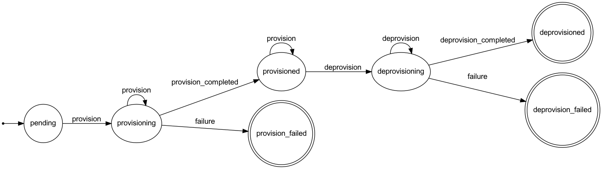

# Mylogger Add-on Demo

This is an example implementation of a Heroku Partner Add-on. More specifically, this add-on lets you persist the log messages
generated by the Heroku application where it's installed. It isn't meant to be useful at all, due to its obvious limitations, but
is a good way to exercise using Heroku's Add-on Partner API and best practices.

## Prerequisites

* Log in or sign up for a free Heroku account at [heroku.com](https://heroku.com).
* Register as an add-on partner on the [Add-on Partner Portal](https://addons-next.heroku.com/).
* Install Heroku's CLI (command line interface tool), if you haven't done that already, following the
  [instructions](https://devcenter.heroku.com/articles/heroku-cli#download-and-install) for your platform.
* [Log in](https://devcenter.heroku.com/articles/heroku-cli#getting-started) with the CLI tool and install
  the Add-ons Admin plug-in following these [instructions](https://github.com/heroku/heroku-cli-addons-admin#installation).

## Implementation steps

Implementation was done through some iterations, by following Heroku's Devcenter documentation on
[Building an Add-on](https://devcenter.heroku.com/articles/building-an-add-on).

### Generating the JSON manifest

I generated the initial manifest as explained
[here](https://devcenter.heroku.com/articles/building-an-add-on#step-1-generate-your-add-on-manifest) and made all the
required changes before [pushing it](https://github.com/heroku/heroku-cli-addons-admin#heroku-addonsadminmanifestpush)
to the Add-on Partner Portal.

My final `addon-manifest.json` file contents were roughly as follows (obviously, I won't put here the sensitive info):

```json
{
  "id": "mylogger-demo",
  "api": {
    "regions": [
      "us"
    ],
    "version": "3",
    "password": "scrubbed password",
    "requires": [
      "syslog_drain"
    ],
    "sso_salt": "scrubbed sso_salt",
    "production": {
      "sso_url": "https://mylogger-addon.herokuapp.com/sso/login",
      "base_url": "https://mylogger-addon.herokuapp.com/heroku/resources"
    },
    "config_vars": [
      "MYLOGGER_DEMO_URL"
    ],
    "config_vars_prefix": "MYLOGGER_DEMO"
  },
  "name": "My Logger Addon Demo",
  "$base": 11111111111111
}
```

> Note: you can't use the words _add-on_ or _addon_ as part of the `id` (aka _slug_) to identify your add-on.
> Be smarter than me.

### Integrating with the Add-on Partner API

Each add-on must provide correctly implemented endpoints for _provisioning_, _deprovisioning_ and _changing plans_.
For this demo I haven't implemented the plan change endpoint as it will never reach GA release stage and there's only a
[free _test_ plan](https://devcenter.heroku.com/articles/bringing-an-add-on-to-market#alpha-stage) allowed, but it's a __MUST__
for a real add-on.

#### Provisioning endpoint

Heroku uses the name _resource_ to identify a provisioned add-on for an application, so it was natural to use the same name here
to model that domain object. Each instance of the
[`Resource`](https://github.com/sbosio/mylogger-addon/blob/master/app/models/resource.rb) model class represents a provisioning
of this Add-on on some Heroku application.

The life cycle of each one of these resources is controlled by a finite state machine defined in the model class using the
[state_machines](https://github.com/state-machines/state_machines) gem.



Provisioning endpoint must respond to `POST` requests sent to the `base_url` defined in the add-on manifest. This is implemented
through Rails routing (in [`config/routes.rb`](https://github.com/sbosio/mylogger-addon/blob/master/config/routes.rb)) as follows:

```ruby
# Heroku's resource provisioning and deprovisioning endpoints
namespace :heroku do
  resources :resources, only: %i[create destroy],
                        constraints: ->(req) { req.headers["Accept"] == Heroku::MimeType::ADDON_PARTNER_API }
  match "*path" => "errors#not_found", :via => :all
end
```

Constraints are applied to the matching endpoint to ensure it's a valid request from the specific Heroku Add-on Partner API
version implemented. Any other request is redirected to a controller that returns a valid response body with a meaningful error
indication as suggested [here](https://devcenter.heroku.com/articles/add-on-partner-api-reference#exceptions).

A valid request to the provisioning endpoint sends credentials to perform HTTP basic authentication. Heroku uses
the `id` as user name combined with the `password` to authenticate (both values are defined in the add-on manifest).
The private method `authenticate!` at
[`Heroku::ResourcesController`](https://github.com/sbosio/mylogger-addon/blob/master/app/controllers/heroku/resources_controller.rb)
handles the authentication.

Once the request passes the authentication, the `create` action will create a new
[`Resource`](https://github.com/sbosio/mylogger-addon/blob/master/app/models/resource.rb) instance with the provided params
and send the `provision` event to it. This event will trigger a callback that enqueues a
[`Heroku::ProvisioningJob`](https://github.com/sbosio/mylogger-addon/blob/master/app/jobs/heroku/provisioning_job.rb) to
perform an
[_asynchronous provisioning_](https://devcenter.heroku.com/articles/add-on-partner-api-reference#asynchronous-provisioning).
The `create` action finalizes by returning a _202 Accepted_ status code as required for asynchronous provisioning.

[`Heroku::ProvisioningJob`](https://github.com/sbosio/mylogger-addon/blob/master/app/jobs/heroku/provisioning_job.rb) will be picked
by the `ActiveJob` handler (in this case I'm using [DelayedJob](https://github.com/collectiveidea/delayed_job)) which makes
a call to the
[`Heroku::ProvisioningManager::ResourceProvisioner](https://github.com/sbosio/mylogger-addon/blob/master/app/services/heroku/provisioning_manager/resource_provisioner.rb)
service object and check the result, raising an exception to force the retry in case of failure.

